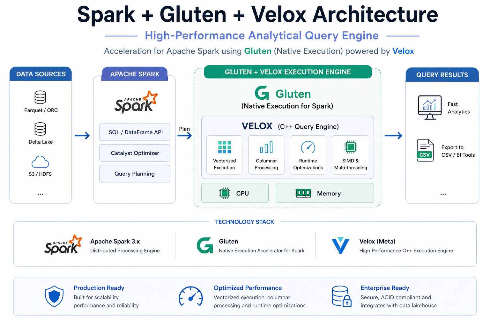

# 🚀 Spark + Gluten + Velox Lakehouse Stack

A high-performance, containerized lakehouse architecture combining Apache Spark, Gluten, and Velox to enable fast, scalable, and efficient data processing.

---

## 🏗️ Architecture Diagram



## 🧩 Architecture Overview

This project demonstrates a modern **Lakehouse architecture** with:

- **Storage Layer**
  - Parquet / ORC formats
  - MinIO (S3-compatible object storage)

- **Metadata Layer**
  - Hive Metastore
  - PostgreSQL backend

- **Compute Layer**
  - Apache Spark (Master + Workers)
  - Catalyst Optimizer

- **Acceleration Layer**
  - Apache Gluten (native execution)
  - Velox (C++ engine with vectorization)

- **Governance (Optional)**
  - Apache Ranger (RBAC & security)

---

## ⚡ How It Works

1. SQL query submitted via Spark or BI tools  
2. Spark optimizes query using Catalyst  
3. Gluten intercepts execution plan  
4. Velox executes query in native engine  
5. Results returned to user  

---

## 🔥 Key Features

- 🚀 Native execution (No JVM overhead)  
- ⚡ Vectorized and columnar processing  
- 📈 Scalable distributed architecture  
- 🧊 Lakehouse-ready (Iceberg / Delta compatible)  
- 🔐 Enterprise-ready with governance support  

---

## 🐳 Tech Stack

- Apache Spark  
- Apache Gluten  
- Velox  
- MinIO  
- Hive Metastore  
- PostgreSQL  
- Docker  

---

## 💡 Use Cases

- Large-scale analytics  
- BI dashboards (Superset / Power BI)  
- Data warehouse modernization  
- Batch + real-time pipelines  

---

## 🚀 Getting Started

```bash
docker-compose up -d